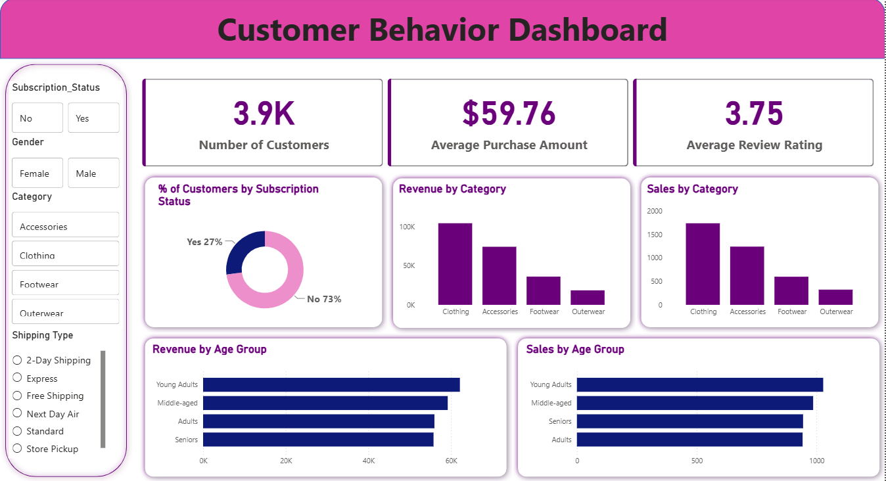

# Customer Shopping Behavior Analysis

An end-to-end analysis of shopping behavior for 3,900 customers, exploring the factors that drive revenue, subscription rate, customer satisfaction (review ratings), and customer segmentation — to support business decisions around pricing, promotions, and retention.

This project walks through a complete real-world Data Analysis pipeline: **Data Cleaning (Python/Pandas) → SQL Analysis (MySQL) → Interactive Dashboard (Power BI)**.



---

## Table of Contents
- [Dataset Overview](#-dataset-overview)
- [Analysis Workflow](#-analysis-workflow)
- [Business Questions Answered](#-business-questions-answered)
- [Key Insights](#-key-insights)
- [Tech Stack & Skills Demonstrated](#-tech-stack--skills-demonstrated)
- [Project Structure](#-project-structure)
- [How to Run](#-how-to-run)
- [Dashboard](#-dashboard)
- [Author](#-author)

---

## Dataset Overview

The dataset contains **3,900 rows** and **18 columns**, describing customer transactions: age, gender, item purchased, category, purchase amount, location, product review, subscription status, shipping type, discount usage, number of previous purchases, payment method, purchase frequency, and more.

| Attribute | Value |
|---|---|
| Rows | 3,900 |
| Original columns | 18 |
| Time period | Snapshot data (no transaction timestamp) |
| Source | Kaggle - Customer Shopping Trends Dataset |

---

## Analysis Workflow

1. **Data Cleaning & Feature Engineering** — [`notebooks/customer-shopping-behavior.ipynb`](notebooks/customer-shopping-behavior.ipynb)
   - Checked for missing values and filled missing `review_rating` with the median rating within each `category` (using `groupby().transform()` — the Pandas equivalent of a SQL window function).
   - Standardized column names to `snake_case`.
   - Engineered an `age_group` column (Young Adults / Adults / Middle-aged / Seniors) using `pd.qcut`.
   - Converted `frequency_of_purchases` (Weekly, Monthly, etc.) into a numeric `purchase_frequency_days` column.
   - Identified that `discount_applied` and `promo_code_used` carried identical information and dropped the redundant column.
   - Loaded the cleaned dataset into MySQL using `SQLAlchemy`.

2. **Exploratory Data Analysis in SQL** — [`sql/customer_behavior_eda.sql`](sql/customer_behavior_eda.sql)
   - 10 business-driven analytical questions, using `GROUP BY`, subqueries, `CASE WHEN`, and window functions (`RANK() OVER (PARTITION BY ...)`).

3. **Data Visualization with Power BI** — [`dashboard/customer_behavior_dashboard.pbix`](dashboard/customer_behavior_dashboard.pbix)
   - Interactive dashboard with slicers for Gender, Category, Shipping Type, and Subscription Status.

---

## Business Questions Answered

The SQL analysis (see [`sql/customer_behavior_eda.sql`](sql/customer_behavior_eda.sql)) answers 10 questions a retail business would realistically ask:

| # | Question |
|---|---|
| 1 | What is the total revenue generated by male vs. female customers? |
| 2 | Which customers used a discount but still spent more than the average purchase amount? |
| 3 | Which are the top 5 products with the highest average review rating? |
| 4 | How does average spend compare between Standard and Express shipping? |
| 5 | Do subscribed customers spend more than non-subscribers? |
| 6 | Which 5 products have the highest percentage of discounted purchases? |
| 7 | How many customers fall into New / Returning / Loyal segments? |
| 8 | What are the top 3 best-selling products within each category? |
| 9 | Are repeat buyers (5+ previous purchases) more likely to subscribe? |
| 10 | How does revenue break down across age groups? |

---

## Key Insights

> The figures below were computed directly from the cleaned dataset.

- **Male customers generated ~68% of total revenue** ($157,890) compared to female customers (~$75,191), despite a relatively balanced gender split in the dataset — suggesting male customers place higher-value orders on average.
- **Overall average order value**: $59.76, **overall average review rating**: 3.75 / 5.
- **Highest-rated product categories**: Gloves (3.86), Sandals (3.84), Boots (3.82).
- **Subscription status has almost no impact on spending**: subscribers spend $59.49 per order on average, while non-subscribers spend $59.87 — nearly identical, even though non-subscribers outnumber subscribers by roughly 2.7x (2,847 vs. 1,053) and account for the majority of total revenue.
- **Young Adults generate the highest revenue by age group** ($62,143), though the difference across age groups is fairly even — no single age group dominates.

---

## Project Structure

```
customer-shopping-behavior-analysis/
│
├── data/
│   └── customer_shopping_behavior.csv   
│
├── notebooks/
│   └── customer-shopping-behavior.ipynb   
│
├── sql/
│   └── customer_behavior_eda.sql       
│
├── dashboard/
│   └── customer_behavior_dashboard.pbix   
│
├── images/
│   └── dashboard_overview.png            
│
├── .env.example                          
├── .gitignore
├── requirements.txt
└── README.md
```

